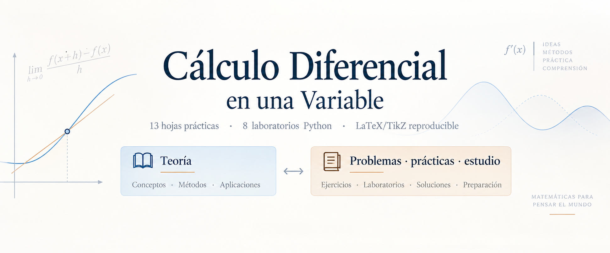

# Cálculo Diferencial en una Variable

<p align="center">
  
</p>


[](https://hdl.handle.net/20.500.14342/7180)
[](https://hdl.handle.net/20.500.14342/7179)
[](LICENSE)
[](LICENSES/MIT.txt)


[](https://github.com/gioda/calculo-diferencial-en-una-variable/releases/tag/v1.0.0)

[](https://github.com/gioda/calculo-diferencial-en-una-variable/stargazers)
[](https://github.com/gioda/calculo-diferencial-en-una-variable/forks)
[](https://github.com/gioda/calculo-diferencial-en-una-variable/issues)
[](https://github.com/gioda/calculo-diferencial-en-una-variable/graphs/contributors)

**Cálculo Diferencial en una Variable** es un recurso educativo abierto en
español para un primer curso universitario de cálculo diferencial. Reúne dos
libros complementarios, trece hojas de prácticas, ocho laboratorios Python y
una selección pequeña de fuentes LaTeX, TikZ y scripts reproducibles.

Autor: **Giovanni Dalmasso, PhD** — Department of Mathematics and Data
Analytics, IQS School of Engineering, Universitat Ramon Llull. La afiliación se
ofrece únicamente como contexto factual; los materiales no se presentan como
una publicación institucional oficial.

## Descargar los libros

| Volumen | Contenido | Descarga |
|---|---|---|
| **Teoría** | Fundamentos, continuidad, derivación, aplicaciones y aproximación de Taylor. | **[Descargar Teoría (PDF)](books/calculo_diferencial_teoria_v1.0.pdf)** |
| **Problemas, prácticas y estudio** | 301 ejercicios, 301 respuestas breves, 30 soluciones desarrolladas seleccionadas, preparación oral y referencias a los laboratorios. | **[Descargar Problemas, prácticas y estudio (PDF)](books/calculo_diferencial_problemas_practicas_estudio_v1.0.pdf)** |

Los dos volúmenes son publicaciones citables por separado:

- **[Teoría — enlace permanente DAU](https://hdl.handle.net/20.500.14342/7180)**
- **[Problemas, prácticas y estudio — enlace permanente DAU](https://hdl.handle.net/20.500.14342/7179)**

## Materiales del curso

- **[Hojas P01–P13](handouts/):** colecciones de trabajo para estudiantes. P07
  es material opcional de consolidación.
- **[Laboratorios Python](labs/):** ocho actividades de representación,
  exploración numérica y aproximación.
- **[Fuentes](src/):** LaTeX y TikZ de los libros y de las hojas, junto con los
  recursos gráficos públicos.
- **[Scripts](scripts/):** construcción de los PDF y generación de figuras.

## Construcción y reutilización

Los requisitos y comandos mínimos están documentados en **[BUILD.md](BUILD.md)**.
La ejecución requiere **Python ≥ 3.9**. Las dependencias se limitan a NumPy y Matplotlib, declaradas en
[`requirements.txt`](requirements.txt). No se necesita ningún registro privado
de soluciones ni la infraestructura interna usada para producir el curso.

## Cita

Cada libro tiene su propia referencia:

- **Teoría:** Dalmasso, G. (2026). *Cálculo Diferencial en una Variable —
  Teoría* (versión 1.0). https://hdl.handle.net/20.500.14342/7180
- **Problemas, prácticas y estudio:** Dalmasso, G. (2026). *Cálculo Diferencial
  en una Variable — Problemas, prácticas y estudio* (versión 1.0).
  https://hdl.handle.net/20.500.14342/7179

[`CITATION.cff`](CITATION.cff) conserva la identidad del repositorio como
paquete de fuentes y remite a los dos libros como obras citables independientes.

## Licencias y atribución

- Libros, hojas, textos educativos, fuentes LaTeX/TikZ y figuras educativas:
  **[CC BY-SA 4.0](LICENSE)**, salvo la fotografía del autor.
- Laboratorios Python, scripts de figuras y código de construcción:
  **[MIT](LICENSES/MIT.txt)**.

La fotografía del autor
(`src/shared/assets/author/giovanni_dalmasso.jpg`) se utiliza con permiso y no
está incluida en la licencia CC BY-SA 4.0 del resto de la obra.

Los nombres y marcas de terceros —incluidos los nombres institucionales usados
como afiliación factual— no quedan licenciados por estas licencias. Consulta
[`LICENSES.md`](LICENSES.md), [`ATTRIBUTION.md`](ATTRIBUTION.md) y
[`BIBLIOGRAPHY.md`](BIBLIOGRAPHY.md) para los detalles.

## Organización

```text
books/       dos libros para estudiantes
handouts/    hojas P01–P13
labs/        ocho laboratorios Python
src/         fuentes LaTeX, TikZ y recursos gráficos
scripts/     construcción y generación de figuras
```

Las erratas y mejoras pueden proponerse siguiendo
[`CONTRIBUTING.md`](CONTRIBUTING.md). Los recursos, soluciones y ediciones
destinados al profesorado se mantienen privados y no forman parte de este
repositorio.
